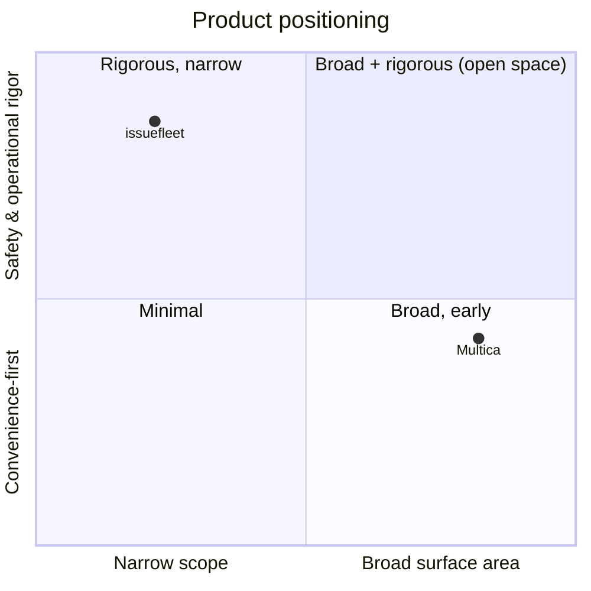
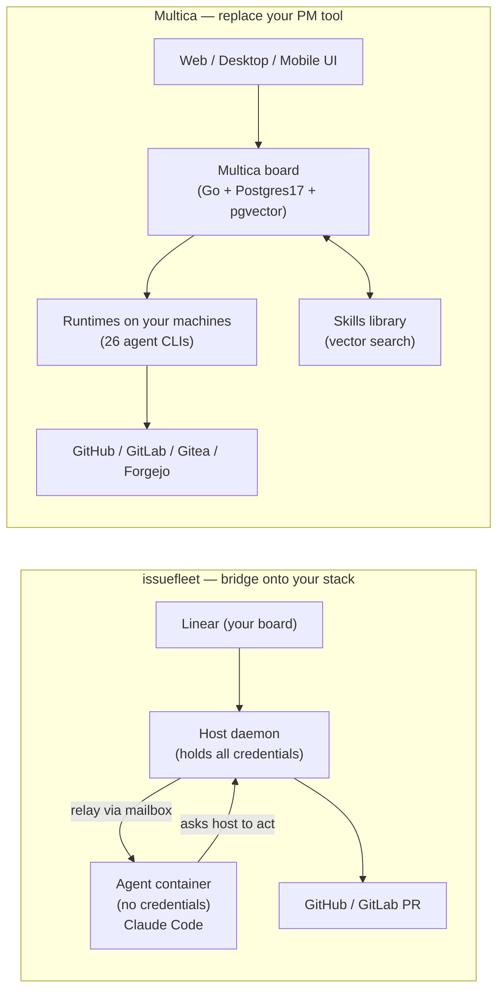

# Multica vs. issuefleet — a competitive brief

*Prepared for CLA-47. Structured top-down (Minto pyramid): the answer first,
then the arguments that support it, then the evidence. Read only the first
screen if that's all you have time for.*

---

## Governing thought

**Multica and issuefleet solve the same problem — "run coding agents as
teammates" — from opposite ends. Multica is a *platform that replaces your PM
tool*; issuefleet is a *safety-first bridge onto the tools you already run.*
issuefleet wins on trust and operational rigor; Multica wins on surface area
and breadth. The highest-leverage things issuefleet can borrow are Multica's
product surface (a native UI/board), its reusable skills library, and its
multi-CLI/multi-model neutrality — none of which compromise issuefleet's
credential-isolation thesis.**

The three supporting arguments:

1. **Different center of gravity.** issuefleet's load-bearing idea is *safety*
   (credentials never touch the agent); Multica's is *product* (an agent-native
   workspace with board, squads, skills, and clients on web/desktop/mobile).
2. **Different scope.** issuefleet is deliberately narrow and deep — Linear →
   GitHub/GitLab, Claude Code, one issue per branch per worktree per container,
   with fully worked-out lifecycle mechanics. Multica is broad and shallower —
   26 agent CLIs, its own board, chat integrations — but early (v0.2.x).
3. **Different bet.** issuefleet bets your existing stack (Linear + Git forge)
   *is* the control plane and it should stay out of the way. Multica bets teams
   want a new, agent-native home and will adopt one.

---

## Visual overview

*(GitHub renders the diagrams below natively; in a plain-text viewer they
appear as fenced `mermaid` code.)*

### Positioning — breadth vs. safety/operational rigor

The two products occupy different corners: Multica maximizes surface area,
issuefleet maximizes trust and lifecycle rigor. The upper-right (both) is open
space neither fully owns yet.

### Same purpose, opposite architectures

### Capability coverage at a glance

Bar length ≈ how much of each dimension the product ships today (illustrative,
derived from the capability table below).

```mermaid
---
config:
    xyChart:
        width: 760
        height: 420
---
xychart-beta
    title "Capability coverage (illustrative, 0-10)"
    x-axis ["Board/UI", "Agent-CLI breadth", "Forge breadth", "Skills library", "Credential isolation", "Lifecycle/crash-safety", "Cost budgets"]
    y-axis "Coverage" 0 --> 10
    bar "issuefleet" [2, 2, 7, 0, 10, 9, 2]
    bar "Multica" [9, 10, 9, 8, 5, 4, 4]
```

---

## Executive summary

| | **issuefleet** (this repo) | **Multica** (multica.ai) |
|---|---|---|
| **One-liner** | Restart-safe daemon that drains a Linear queue into GitHub/GitLab PRs via a fleet of Claude Code agents | Open-source, agent-native workspace that manages coding agents like teammates on a task board |
| **Category** | Orchestration *bridge* (headless) | Orchestration *platform* (full product) |
| **Load-bearing idea** | Credentials never enter the agent container | Humans + agents as one team in a shared workspace |
| **Board / PM** | Uses **Linear** as the board (no board of its own) | **Ships its own** board, projects, squads, autopilots |
| **Agents** | Claude Code (`claude -p` turnloop) | 26 agent CLIs (Claude Code, Codex, Cursor, Gemini, Grok, Qwen, …) |
| **Forge** | GitHub + GitLab (narrow `Forge` port) | GitHub, GitLab, Gitea, Forgejo |
| **UI** | Read-only introspection dashboard + Signal/Discord bots | Web + Electron desktop (mac/win/linux) + iOS app |
| **Tech** | Stdlib-only Python 3.11 (Bazel/Nix build) | Next.js 16 + Go + PostgreSQL 17 (+ pgvector) |
| **Deploy** | Single host daemon | Docker Compose / Helm self-host, or hosted cloud |
| **Skills library** | ❌ none | ✅ pgvector embeddings + similarity search |
| **Maturity** | Deep, honestly-documented edges | Early (v0.2.x), "rough edges" per project |
| **License** | No `LICENSE` file in repo (unstated) | Multica License = Apache-2.0 + hosted/branding conditions |

**Bottom line:** the two products barely overlap in *shape* even though they
overlap almost completely in *purpose*. A buyer chooses issuefleet to bolt
safe, hands-off agents onto Linear + GitHub without changing how the team
works; they choose Multica to adopt a new agent-native workspace and get a UI,
many agent CLIs, and cross-team coordination out of the box.

---

## Argument 1 — Different center of gravity

### issuefleet is organized around *not trusting the agent*

The architecture's stated "load-bearing idea" is that **agent containers get no
credentials at all**. Containers run with permission prompts disabled, so the
Linear key and GitHub token stay host-side in the orchestrator; the worker's
*only* channel to the world is a filesystem mailbox (`outbox/` for
status/question/ready/file_issue, `inbox/` for replies/PR-feedback/CI). Every
credentialed act — post a comment, push a branch, open a PR, file an issue — is
performed by the host after the worker asks for it. This is the whole design's
spine, and everything else (relay dedupe, the credential-scan gate on `ready`,
HTTPS-token-not-SSH, branch protection as the PR-only enforcement) hangs off it.

### Multica is organized around *being the workspace*

Multica's framing is "make humans and AI agents work as one team." It ships the
things a workspace needs: a task board with a full lifecycle (enqueue → claim →
execute → complete/fail), **squads** (agents + humans on one team with leader
routing), **workspaces** (separate agents/issues/settings per team), RBAC
(`owner`/`admin`/`member`), **autopilots** (scheduled standups, audits,
reports), an execution log that replays every tool call, token-usage tracking,
and clients on web, desktop, and mobile. Its security model exists (env-var
config, agent-reach restrictions, RBAC) but it is a *feature of the platform*,
not the organizing principle the way credential isolation is for issuefleet.

**So what:** issuefleet is the right tool when the agent must be treated as
untrusted and the human's existing tools must stay authoritative. Multica is the
right tool when the goal is a single agent-native home that a whole team lives in.

---

## Argument 2 — Different scope (narrow-and-deep vs. broad-and-early)

### Capability comparison

| Capability | issuefleet | Multica | Notes |
|---|:---:|:---:|---|
| Native task board / PM UI | ❌ | ✅ | issuefleet uses Linear as its board by design |
| Web UI | 🟡 read-only dashboard | ✅ full app | issuefleet's is introspection, not control-first |
| Desktop / mobile clients | ❌ | ✅ | Electron + iOS |
| Multiple agent CLIs | ❌ (Claude Code only) | ✅ (26) | issuefleet's biggest single gap |
| Multiple git forges | ✅ (GitHub, GitLab) | ✅ (+ Gitea, Forgejo) | |
| Linear integration | ✅ (deep; agents platform) | ❌ | issuefleet's home turf |
| Chat integrations | 🟡 Signal + Discord bots | ✅ Slack/Lark/DingTalk/WeCom/Telegram | |
| Reusable **skills library** | ❌ | ✅ (pgvector) | issuefleet's biggest capability gap |
| Squads / RBAC / multi-tenant | ❌ | ✅ | issuefleet is single-workspace, single-key |
| Scheduled autopilots | 🟡 roadmap/summary bots | ✅ standups/audits/reports | |
| Credential isolation from agent | ✅ (the core thesis) | 🟡 RBAC + reach limits | different philosophies |
| Per-issue worktree + container | ✅ | 🟡 runtimes on your machines | issuefleet's isolation is stronger/explicit |
| Restart-safe / crash-recovery | ✅ (durable registry, polling truth) | ❓ not documented | issuefleet's strength |
| Adopt / release / takeover a branch | ✅ | ❌ | hand a branch to a human and back, resuming the same session |
| Webhooks as accelerator, polling as truth | ✅ | 🟡 WebSocket streaming | issuefleet degrades gracefully when the tunnel is down |
| Relay dedupe (exactly-surfaced comments) | ✅ (HTML-comment markers) | ❓ | |
| Credential-scan gate before PR | ✅ (on `ready`) | ❓ | |
| Per-project / per-branch model & effort | ✅ | 🟡 per-agent config | |
| Cost / token budgets | ❌ (only `max_auto_turns`) | ✅ token tracking | both lack hard wall-clock/$ budgets |
| Self-host | ✅ | ✅ | |
| Hosted cloud option | ❌ | ✅ | |

Legend: ✅ has it · 🟡 partial/adjacent · ❌ lacks it · ❓ not clearly documented.

### Where issuefleet is genuinely *deeper*

issuefleet has worked out the operational long tail that a young platform
usually hasn't:

- **Graceful degradation.** Webhooks are only an accelerator; polling is the
  source of truth, so a dropped/replayed delivery or a downed tunnel costs
  latency, never correctness.
- **Human-in-the-loop branch handoff.** Release → edit locally in the *same
  resumed Claude session* → adopt back, robust even across a rebase onto newer
  mainline. `takeover` wraps the whole loop into one command.
- **At-least-once relay with explicit dedupe** so a crash between "posted" and
  "acked" can't double-post.
- **A published, honest "Known edges" list** (cost, mid-turn stop loses a turn,
  force-push can lose a diverged side, single-workspace-per-config, new Linear
  agents API unproven live). This candor is itself a competitive asset.

### Where Multica is genuinely *broader*

- **Agent neutrality** — 26 CLIs and multiple models, no lock-in.
- **A real product surface** — board, squads, autopilots, RBAC, and native
  clients that non-technical stakeholders can use.
- **A compounding skills library** backed by vector search.

**So what:** issuefleet trades breadth for a rigor Multica hasn't reached yet;
Multica trades rigor for a breadth issuefleet has chosen not to build.

---

## Argument 3 — Different bet on where teams want to work

issuefleet's bet: your Linear board and your GitHub/GitLab repo already *are*
the control plane; the orchestrator should be invisible plumbing that keeps the
agent untrusted and out of your way. Multica's bet: teams feeling
"coordination pain" (agents on different machines, nobody knowing what's
automated) will adopt a new agent-native workspace to centralize it.

Both bets can be right for different buyers. The strategic risk for issuefleet
is that if Multica-style platforms win the "workspace" framing, issuefleet
looks like a component rather than a product. The strategic risk for Multica is
that teams refuse to move off Linear/Jira and prefer a bridge — exactly
issuefleet's shape.

---

## What issuefleet can learn / improve — ranked by leverage

Ordered by (impact × fit-with-thesis). Each is achievable *without* weakening
credential isolation.

| # | Opportunity | Why it matters | Cost / risk | Notes |
|---|---|---|---|---|
| 1 | **Reusable skills library** | Multica's compounding moat; issuefleet has none. Solved problems should become playbooks every future worker reuses. | Medium. Fits the host-side model — store skills host-side, inject into the worktree at claim time. | issuefleet already ships skills into worktrees (`.claude-container-overlay/skills`); a curated, searchable, growing library is the missing half. |
| 2 | **Multi-CLI / multi-model support** | Single biggest capability gap. Today it's Claude Code only; Multica supports 26 CLIs. Even 2–3 (Codex, Gemini) hedges provider risk and widens the market. | Medium–High. The `claude -p` turnloop is load-bearing; a narrow `AgentRunner` port (mirroring the `Forge` port) would generalize it. | Per-project/branch model selection already exists — extend that to *which CLI*. |
| 3 | **Cost / token / wall-clock budgets** | Both tools lack hard budgets; issuefleet's own "Known edges" flags "N agents is real money, `max_auto_turns` is the only brake." A per-issue/per-fleet $ and token ceiling is table stakes for adoption. | Low–Medium. Token usage is already visible in transcripts; add ceilings + teardown. | Multica at least *tracks* tokens per agent/issue. |
| 4 | **A control-first UI surface** | The dashboard is intentionally read-only-ish; Multica's UI lets non-technical stakeholders assign/track. A richer (still safe, POST-gated) UI widens who can drive the fleet. | Medium. Keep it a tailnet control plane; don't expose publicly. | Build on the existing dashboard + `/adopt` + Add-project forms. |
| 5 | **Broader chat integrations** | Multica has Slack/Lark/Telegram/etc.; issuefleet has Signal + Discord. Slack especially unblocks most orgs. | Low–Medium. Fleet-manager pattern already abstracts the chat front-end. | The Signal fleet-manager is a good template to generalize. |
| 6 | **Multi-workspace / multi-tenant** | issuefleet is one Linear workspace per config (its own "Known edges"). Multica has workspaces + RBAC. Matters for agencies / multiple orgs. | High. Touches the credential and registry model. | Lower priority; conflicts less with thesis but is a big lift. |

### What issuefleet should *not* copy

- **Becoming a full PM platform.** Replacing Linear/Jira dilutes the "bridge"
  thesis and pits it against much larger incumbents. Staying a bridge is a
  feature, not a limitation.
- **Weakening credential isolation** for UX convenience. This is the moat;
  every borrowed feature above is designed to preserve it.

---

## Appendix — sources

- Multica repo — <https://github.com/multica-ai/multica>
- Multica org — <https://github.com/multica-ai>
- "Multica: An Open-Source Platform for Managing AI Coding Agents Like
  Teammates" (DEV) —
  <https://dev.to/arshtechpro/multica-an-open-source-platform-for-managing-ai-coding-agents-like-teammates-2469>
- "Managed Agents vs DIY Agents: Multica and Claude in 2026" (Ruh AI) —
  <https://www.ruh.ai/blogs/managed-agents-vs-diy-agents-multica-vs-claude-2026>
- "What Is Multica AI?" (multica.uk) — <https://www.multica.uk/guides/multica-ai>
- issuefleet — this repository's `README.md` (architecture, lifecycle,
  webhooks, dashboard, "Known edges").

*Method note: Multica details are drawn from its public repo and secondary
write-ups as of September 2026 (v0.2.x); some cells marked ❓ reflect
undocumented rather than absent capabilities. issuefleet details are from this
repo's README. Where the two describe the same capability differently, the
table reflects the stated design, not measured behavior.*
